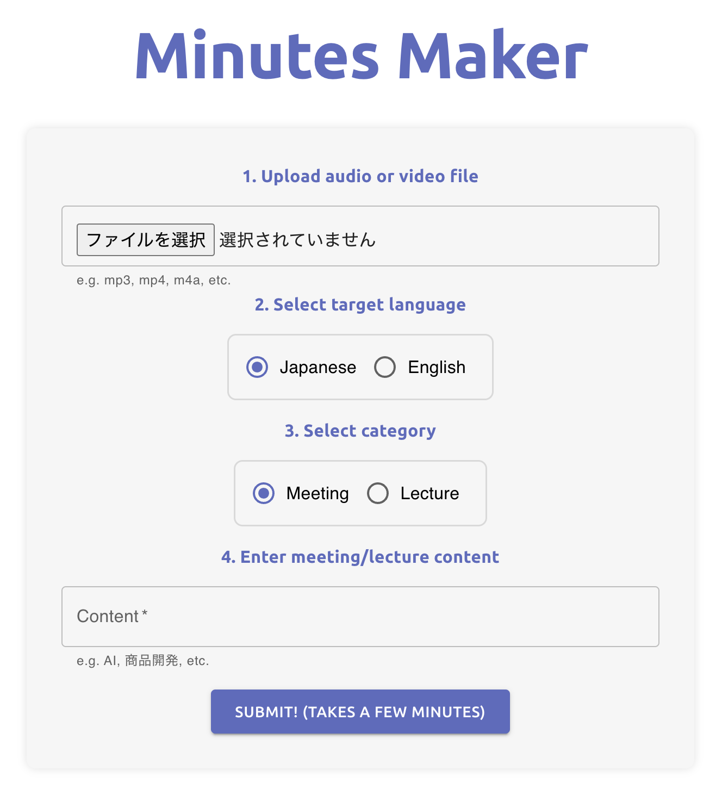

# Minutes Maker

<h1 align="center">
  
</h1>

**Minutes Makerは、会議や講義の書き起こしと要約を自動生成するウェブアプリです。**

## Overview

主な機能:

- [faster-whisper](https://github.com/guillaumekln/faster-whisper)を使用して、**ほぼ全ての音声/動画ファイルを書き起こすことができます。**
- [OpenAIの言語モデル](https://openai.com/blog/openai-api/)を使用して**要約を作成します。**
- **Webインターフェース**で操作可能です。
- **英語と日本語**に対応しています。
- **GPU**に対応しているほか、**CPU**のみのコンピューターでも動作します。

## Installation

#### 1. 環境変数を`.env`ファイルに設定

以下の環境変数を設定する必要があります。

- `OPENAI_API_KEY`は要約作成のために必要となるAPIキーで、[こちら](https://platform.openai.com/account/api-keys)で発行できます。

- `REACT_APP_PUBLIC_IP`は、アプリケーションを実行するマシンの公開IPアドレスです。
  - アプリをローカルマシンでデプロイする場合は、`'0.0.0.0'`になります。
  - アプリをリモートサーバーでデプロイする場合は、サーバーの公開IPアドレスになります。

以下のコマンドを実行することで、環境変数を`.env`ファイルに設定できます：

```bash
cd minutes-maker
echo "OPENAI_API_KEY='sk-XXX'" >> .env
echo "REACT_APP_PUBLIC_IP='XXX.XXX.XXX.XXX'" >> .env
```

#### 2. Dockerイメージをビルド

マシンがNVIDIA GPUを持っているかどうかは自動的に検出され、適切なDockerイメージがビルドされます。

```bash
make build
```

#### 3. アプリケーションを実行

```bash
make up
```

#### 4. アプリケーションにアクセス

ブラウザで`http://<PUBLIC_IP or 0.0.0.0>:10356`を開きます。

## Usage

<p align="center">
  
</p>

**フォームの簡単な説明は以下の通りです:**

1. 音声/ビデオファイルのアップロード

    書き起こしと要約を行いたい音声/動画ファイルを選択します。ほぼ全ての音声/動画ファイルが使用でき、ファイルサイズに制限はありません。

2. `target language`の選択

    _どの言語で要約したいか_の言語を選択します。
    現在、英語と日本語がサポートされています。

3. `category`の選択

    音声/動画ファイルの内容のカテゴリー、`meeting`または`lecture`を選択します。このパラメータを適切に設定すると、要約の品質が向上します。

4. `meeting`/`lecture`内容の入力

    `meeting`や`lecture`の内容、例えばテーマ（例："新製品の開発"）を入力します。
    内容を適切に設定すると、書き起こしの品質が向上します。

## Requirements

- コンピューター
- Docker

## License

このリポジトリはCC BY-NC-SA 4.0ライセンスの下でライセンスされています。詳細は[LICENSE](./LICENSE)をご覧ください。
